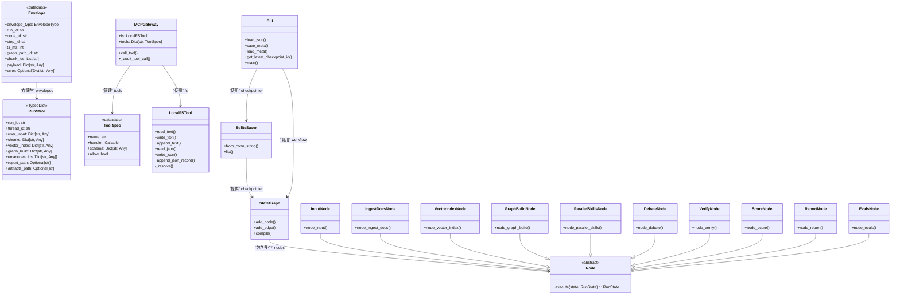
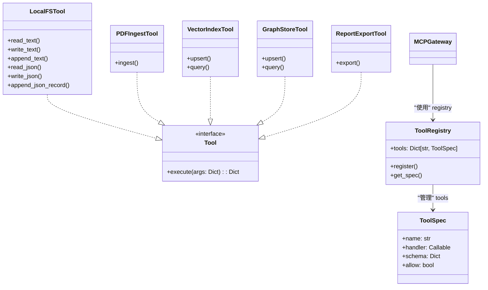
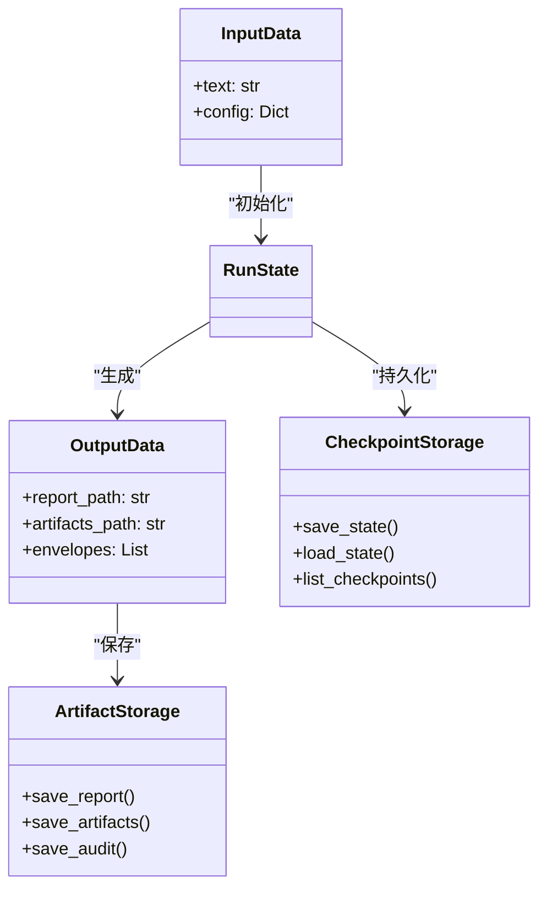
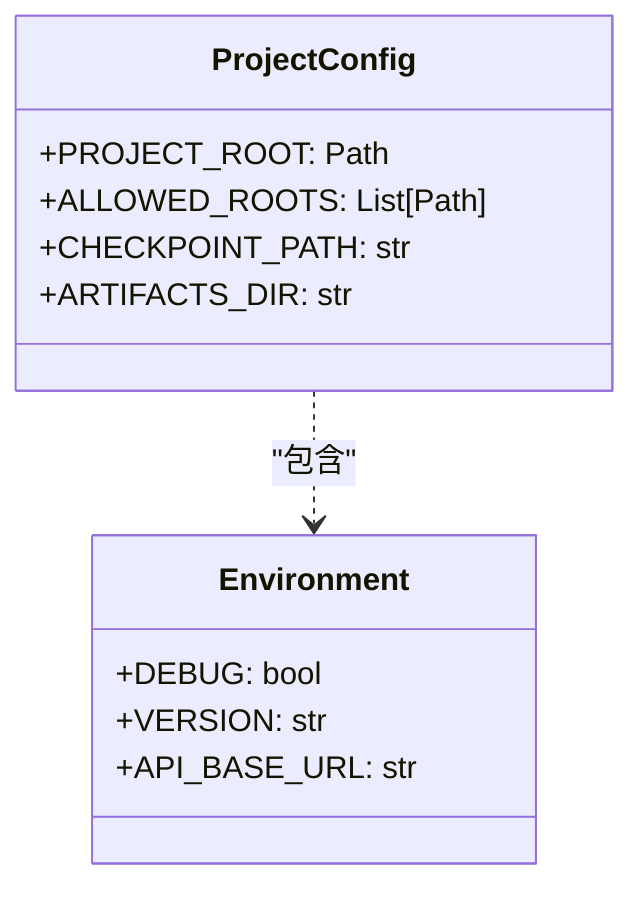

# MiniPolicy 项目类图

## 核心类结构图



## MCP 工具层次结构



## 数据流类图



## 项目配置类图



## 完整的系统架构类图

```mermaid
classDiagram
    %% 分层架构
    package "表示层" {
        class WebUI
        class CLI
    }
    
    package "应用层" {
        class FastAPI
        class LangGraphRuntime
    }
    
    package "领域层" {
        class MCPGateway
        class ToolRegistry
        class Node
    }
    
    package "基础设施层" {
        class LocalFSTool
        class SqliteSaver
        class ArtifactStorage
    }
    
    %% 依赖关系
    WebUI --> FastAPI
    CLI --> FastAPI
    FastAPI --> LangGraphRuntime
    LangGraphRuntime --> MCPGateway
    MCPGateway --> ToolRegistry
    MCPGateway --> LocalFSTool
    LangGraphRuntime --> SqliteSaver
    Node --> ArtifactStorage
