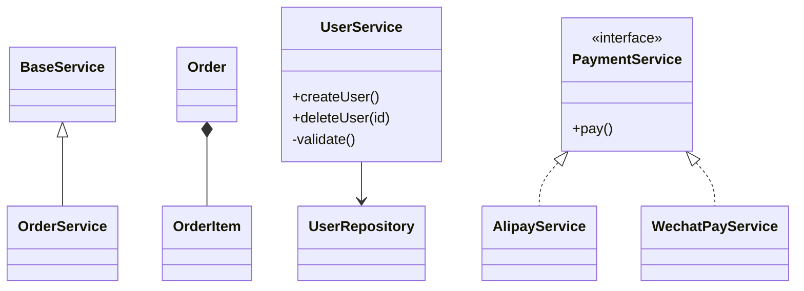

```mermaid
classDiagram

    class BaseService
    class OrderService
    class Order
    class OrderItem
    class UserRepository
    class UserService {
        +createUser()
        +deleteUser(id)
        -validate()
    }
    class PaymentService {
        <<interface>>
        +pay()
    }
    class AlipayService
    class WechatPayService

    UserService --> UserRepository
    BaseService <|-- OrderService
    Order *-- OrderItem
    PaymentService <|.. AlipayService
    PaymentService <|.. WechatPayService


```