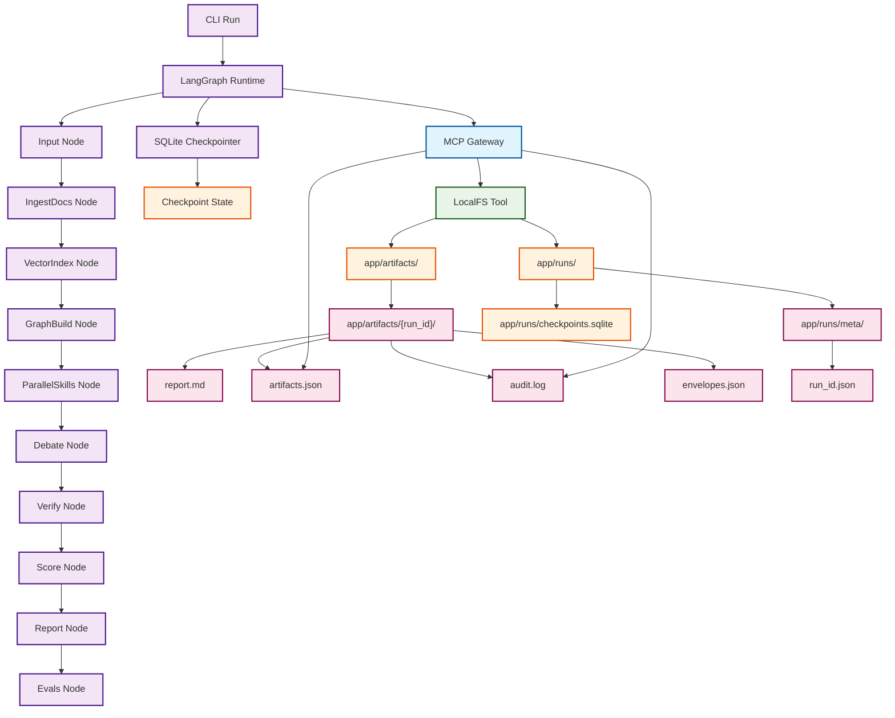
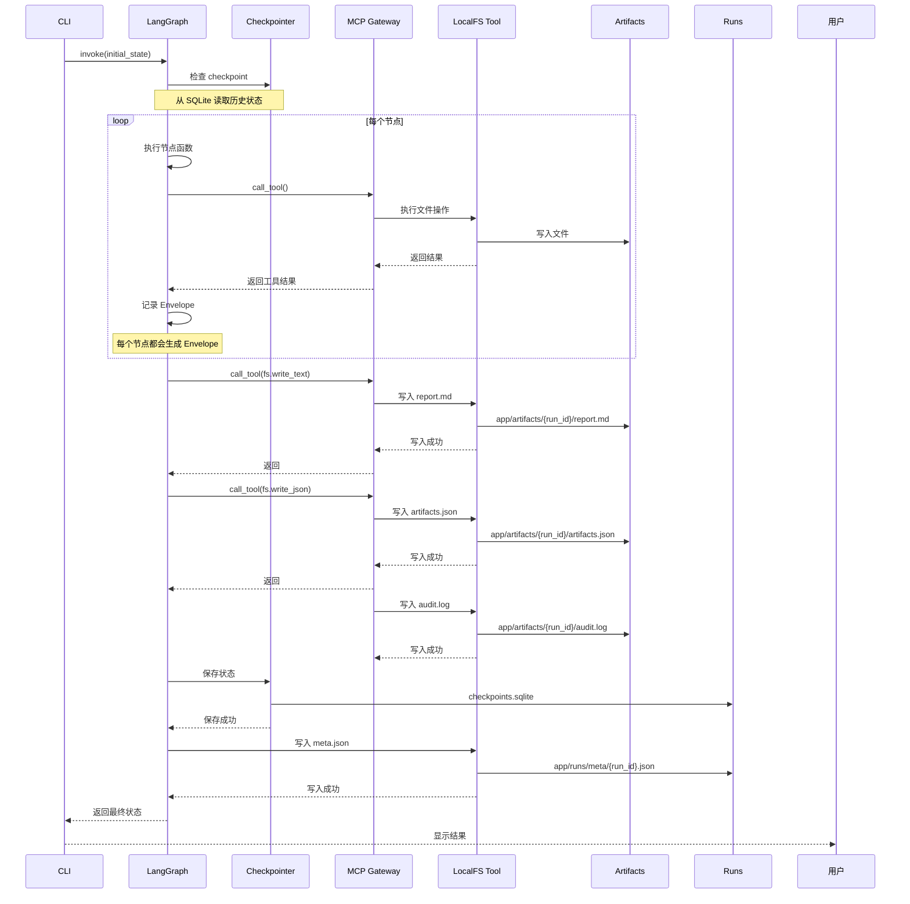
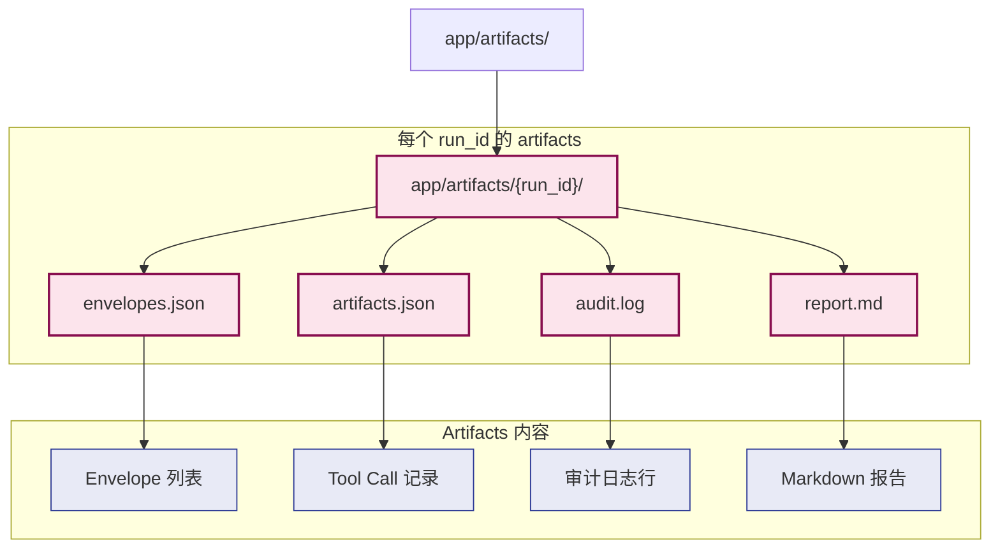
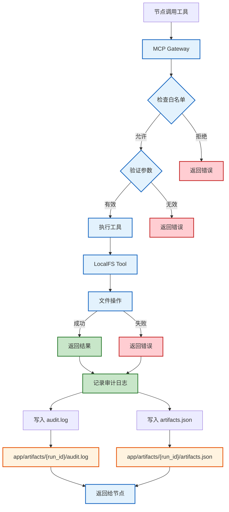

# MiniPolicy Phase 0-1 流程图指南

## Phase 0-1 核心流程



## Phase 0-1 数据流详细图



## Artifact 目录结构



## Runs 目录结构

```mermaid
graph TD
    RUNS[app/runs/]
    
    subgraph RunStorage["运行时存储"]
        META[app/runs/meta/]
        CHECKPOINTS[app/runs/checkpoints.sqlite]
    end
    
    subgraph MetaFiles["Meta 文件"]
        META_JSON[run_id.json]
        META_INFO[run_id 和 thread_id]
        META_DESC[运行元数据：run_id 和 thread_id 的映射]
        META_EX[示例：{"run_id": "run_5f80c3a21e", "thread_id": "run_5f80c3a21e"}]
    end
    
    subgraph CheckpointData["Checkpoint 数据"]
        CP_DB[SQLite 数据库]
        CP_STATES[状态记录]
        CP_CONFIGS[配置信息]
    end
    
    RUNS --> META
    RUNS --> CHECKPOINTS
    META --> META_JSON
    META_JSON --> META_INFO
    CHECKPOINTS --> CP_DB
    CP_DB --> CP_STATES
    CP_DB --> CP_CONFIGS
    
    %% 样式
    classDef storage fill:#fff3e0,stroke:#e65100,stroke-width:2px
    classDef data fill:#e0f2f1,stroke:#004d40,stroke-width:1px
    
    class META,CHECKPOINTS,CP_DB storage
    class META_INFO,CP_STATES,CP_CONFIGS data
```

## 审计流程详细图



## Phase 0-1 完整执行流程

```mermaid
flowchart LR
    subgraph User["用户层"]
        CLI[CLI 命令]
    end
    
    subgraph Runtime["运行时层"]
        LG[LangGraph Runtime]
        CP[SQLite Checkpointer]
    end
    
    subgraph Control["控制层"]
        MCP[MCP Gateway]
        FS[LocalFS Tool]
    end
    
    subgraph Storage["存储层"]
        ART[Artifacts 目录]
        RUNS[Runs 目录]
    end
    
    subgraph Artifacts["Artifacts 内容"]
        REPORT[report.md]
        ARTIFACTS[artifacts.json]
        AUDIT[audit.log]
        ENVELOPES[envelopes.json]
    end
    
    subgraph Runs["Runs 内容"]
        META[meta/]
        CHECKPOINT[checkpoints.sqlite]
    end
    
    CLI --> LG
    LG --> CP
    LG --> MCP
    MCP --> FS
    FS --> ART
    FS --> RUNS
    
    ART --> REPORT
    ART --> ARTIFACTS
    ART --> AUDIT
    ART --> ENVELOPES
    
    RUNS --> META
    RUNS --> CHECKPOINT
    
    %% 样式
    classDef user fill:#e8eaf6,stroke:#3f51b5,stroke-width:2px
    classDef runtime fill:#e0f2f1,stroke:#009688,stroke-width:2px
    classDef control fill:#e1f5fe,stroke:#039be5,stroke-width:2px
    classDef storage fill:#fff3e0,stroke:#f57c00,stroke-width:2px
    classDef artifact fill:#fce4ec,stroke:#c2185b,stroke-width:2px
    
    class CLI user
    class LG,CP runtime
    class MCP,FS control
    class ART,RUNS storage
    class REPORT,ARTIFACTS,AUDIT,ENVELOPES artifact
