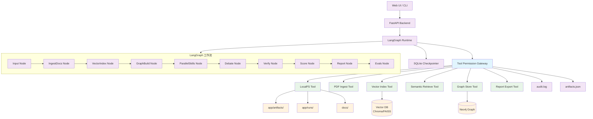
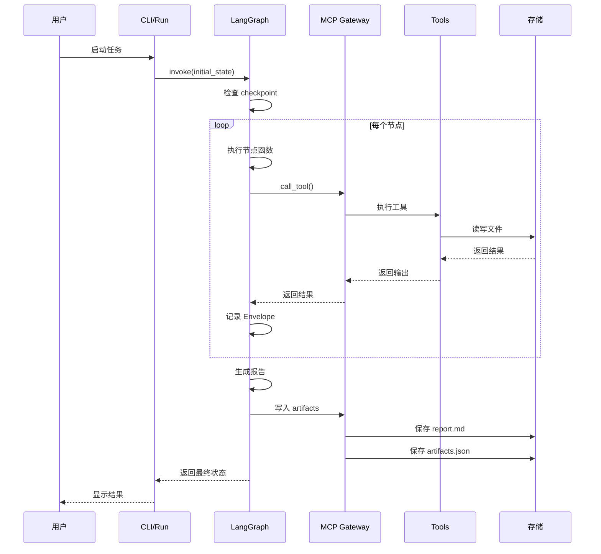
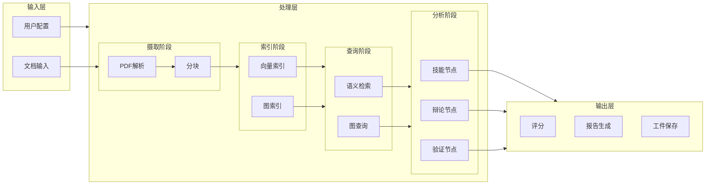

# MiniPolicy 项目流程图

## 系统架构流程图



## 详细工作流流程图



## 数据流向图



## MCP 工具调用流程

```mermaid
flowchart TD
    CALL[节点调用工具] --> GATE[Gateway 接收]
    
    GATE --> CHECK{检查白名单}
    CHECK -->|允许| VALID{验证参数}
    CHECK -->|拒绝| DENY[返回错误]
    
    VALID -->|有效| EXEC[执行工具]
    VALID -->|无效| INVALID[返回错误]
    
    EXEC --> TOOL[具体工具实现]
    TOOL --> FS[文件系统操作]
    TOOL --> DB[数据库操作]
    
    FS -->|成功| OK[返回结果]
    FS -->|失败| ERR[返回错误]
    
    OK --> AUDIT[记录审计日志]
    ERR --> AUDIT
    
    AUDIT --> RETURN[返回给节点]
    
    %% 样式
    classDef success fill:#c8e6c9
    classDef error fill:#ffcdd2
    classDef process fill:#e3f2fd
    
    class OK,EXEC,AUDIT success
    class DENY,INVALID,ERR error
    class GATE,CHECK,VALID,TOOL,FS,RETURN process
